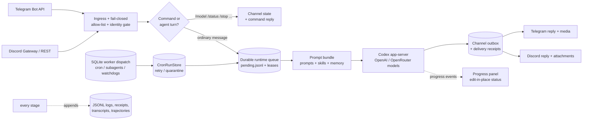

<div align="center">

# Agent Harness Core

**Self-hosted AI agent runtime in Rust. Run autonomous LLM agents over Telegram and Discord — with durable queues, fail-closed permissions, and an auditable receipt for every single step.**

[](#license)
[](rust-toolchain.toml)
[](Cargo.toml)
[](crates/agent-harness-core/Cargo.toml)
[](#faq)
[](CHANGELOG.md)

[Quick Start](#quick-start) •
[Features](#why-agent-harness-core) •
[Adaptive Skills](docs/adaptive-skill-intelligence.md) •
[Architecture](#how-it-works) •
[CLI](#cli-at-a-glance) •
[Docs](#documentation) •
[FAQ](#faq)

</div>

---

## What is Agent Harness Core?

Agent Harness Core is a **self-hosted AI agent harness written in Rust**: a runtime that connects chat channels (Telegram, Discord) to LLM coding agents (OpenAI Codex app-server, plus any model reachable through OpenRouter — Claude, GPT, Gemini, and more) through a durable job queue, bounded concurrency, and append-only JSONL receipts for every turn.

It is **not** another prompt-orchestration library. It is the **operations layer** for personal and small-team AI agents — the part that answers questions frameworks usually leave to you:

- What happens when the process dies mid-turn? *(durable queue + completed-turn recovery — the turn is not lost)*
- Who is allowed to talk to my agent? *(fail-closed allow-lists plus platform/account/channel identity bindings)*
- What exactly did the agent do at 03:12? *(append-only JSONL logs, receipts, transcripts, and trajectories for everything)*
- How do I stop a runaway turn? *(`/stop` cancel markers honored by the runtime poll loop)*

Born as a ground-up Rust rebuild of a Docker-based legacy agent gateway ("OpenClaw"), it keeps full import compatibility with that ecosystem — agents, sessions, skills, cron jobs, subagents, and memory snapshots migrate in with dry-run reports and receipts.

## Why Agent Harness Core?

| | What you get |
|---|---|
| 🧾 **A receipt for everything** | Every ingress, queue write, model turn, delivery, and retry appends to JSONL ledgers. Reconstruct any incident after the fact — no black boxes. |
| 📨 **Chat-native agents** | First-class Telegram Bot API and Discord (REST + Gateway) adapters: replies, policy-gated media attachments, referenced-media artifacts, message splitting, edit-in-place progress panels, default-off opt-in final-reply tone, and `/new` `/model` `/think` `/reasoning` `/steer` `/stop` `/status` commands. |
| 🔐 **Fail-closed by default** | DMs require explicit admin allow-lists, and ingress must resolve a platform/account/channel identity binding before dispatch. Unknown senders or ambiguous channel bindings never reach the model. |
| ⚙️ **Durable, bounded work** | SQLite-backed worker dispatch with leases, retry/backoff, stale reaping, watchdogs, and concurrency limits per global / agent / channel / lane. Runtime dispatch classes isolate interactive, cron, worker, and maintenance turns so noisy cron work does not block channel agents. |
| 🧵 **Long-task continuity** | A turn's session lives inside a stable **virtual session**. Backend-reported context windows are persisted, compact/resume events are correlated to the requesting operation, and safe rollover carries a bounded **working set** (goal, plan refs, decisions, open files, validation, blockers) under the same exact lane. `/new` remains a hard task boundary. |
| 🤖 **Model-agnostic routing** | Codex app-server executes turns; OpenRouter routing switches any conversation to e.g. `anthropic/claude-sonnet-4` with one `/model` command. Provider-specific Codex homes keep OpenRouter config out of the default Codex/OAuth path; secrets are checked at preflight, never written to disk. |
| 🧭 **Capability-aware reasoning** | The v0.8.0 model catalog resolves the exact provider/model capability surface instead of assuming one global effort list. `/think` and `/reasoning` are aliases for one last-write-wins setting. Exact `max` is the highest currently known legal GPT-5.6 effort; unknown future names are accepted only when that exact route advertises them. Exact `ultra` is filtered and rejected, never advertised or configured as an effort. |
| 🧩 **Per-agent runtime context** | Every configured agent can use its own OpenClaw-style model and eight-file static prompt inventory, with fallback aliases and deletion tombstones. Canonical prompt manifests are keyed by the exact virtual-session lane and Codex backend generation, while dynamic memory recall remains a separate per-turn context source. |
| 🕸️ **Master-owned delegation** | A master agent can assign a different provider/model/effort policy to every child. Child terminals enter a bounded, actually redacted, exact-owner mailbox with opaque artifact pointers; child progress, final text, and errors stay internal, and only a lease-owning master continuation can acknowledge results and create user-facing output. |
| 🧠 **Memory-aware** | OpenClaw-compatible memory hooks (recall, lifecycle capture, store proposals) with vector recall over imported SQLite embeddings — integrated via adapters, not forks. |
| 📦 **Skills as runtime state** | Versioned, indexed `SKILL.md` runbooks are matched per turn and injected once per session via an injection ledger. Shadow runtime receipts observe matching and outcomes with zero serving-side effects; generated skills are proposal-only by default, and guarded apply requires explicit operator authorization. |
| 🌐 **Policy-owned web search** | Codex built-in web search defaults to cached mode. Explicit freshness intent may request live search; sensitive, offline, and replay contexts force it disabled. Sandbox selection never changes the web-search policy implicitly. |
| 🔑 **Operator-owned backend auth** | Provider-scoped Codex homes isolate credentials. Account inspection, browser/device-code/API-key login, cancel/logout/refresh/restart reconciliation, and `needs-operator-auth` defer/resume stay on operator-only CLI surfaces; ordinary agent turns never receive credential material. |
| 🪶 **Minimal dependencies** | Six crates: `serde`, `serde_json`, `ureq`, `rusqlite`, `ring`, `base64`. No tokio, no async runtime, no clap. Synchronous Rust you can read in an afternoon and audit forever. |
| 🔑 **Encrypted secret vault** | Repo-local vault using PBKDF2-HMAC-SHA256 + ChaCha20-Poly1305; `vault-get` reports presence and length, never plaintext. |
| 🔁 **Legacy migration built in** | Read-only dry-run import plans, conflict policies (skip/overwrite/rename), safe-copy execution that skips raw secrets by default, and cutover readiness gates. |

### Adaptive skill intelligence — design direction

Agent Harness Core is extending skills from matched runbooks into an **evidence-governed procedural learning system**. The target is an agent that combines external guidance with verified task experience, reflects on what worked under which conditions, and accumulates reusable individual capability without turning every transcript or popular workflow into permanent prompt text.

The design uses competence-role retrieval, minimal sufficient disclosure, virtual-session revision manifests, contextual and uncertainty-aware skill beliefs, cost-aware evaluation, and reversible promotion. Existing selection receipts, proposal-mediated mutation, guards, and lifecycle controls are the foundation; outcome-linked learning, consolidation, and progressively autonomous promotion remain a product direction, not a claim that the complete loop is active. Read [Adaptive Skill Intelligence](docs/adaptive-skill-intelligence.md) or the [web essay](https://phenomenoner.github.io/agent-harness-core/essay/adaptive-skill-intelligence/) for the rationale, architecture, measurement model, and delivery boundary.

## How It Works



The harness owns ingress, permissions, queuing, prompt assembly, delivery, long-task continuity, and audit. **Codex owns the model**: system prompt, tool schemas, MCP, sandbox, approvals, and session continuity. That split keeps the harness small, deterministic, and testable — 1,200+ tests run without any model call, using a bundled fake Codex app-server.

### v0.10.0 continuity and external-effect boundary

The v0.10.0 checkpoint makes channel continuity and external mutations explicit state-machine
contracts. Exact channel-session identity is canonicalized before dispatch, queued work remains
distinct from leased work, continuation parents cannot impersonate logical success, and structured
provider overload recovery is gated by durable mutation evidence and retry eligibility.

Eligible ordinary interactive turns can use a default-off productive-deadline policy: exact-owned,
deduplicated progress may extend a bounded deadline only after the runtime proves queue-lease coverage,
while pending same-lane work, hard caps, task budgets, and control boundaries reclaim the lane. Once
bounded yield begins it is irreversible. The harness owns the primary outcome and selects exactly one
logical final, deterministic continuation child, parked notice, or one bounded observation-only recovery
child; any generation-bound model disposition is advisory evidence rather than outcome authority.
OperationPlan continuation still requires a current exact-lane, versioned checkpoint. Recognized MCP connector
elicitations park as `WaitingForApproval`; exact-lane expiring approve/deny capabilities and
connector-specific readback prevent ambiguous writes from being blindly resubmitted. Provider error
diagnostics are retained without absolute request URLs or credentials.

These contracts are covered by sanitized Telegram/Discord scenario replays, restart and crash-window
matrices, terminal-index reconciliation tests, and the public invariant/schema/scenario catalogs.
Live deployment receipts and operator runbooks remain outside the public repository surface.

### v0.9.0 runtime boundary

The v0.9.0 deployment contract exact-pins Codex CLI 0.144.5 and requires the supervisor to launch a deployment-owned canonical executable whose path, version, and SHA-256 are receipted. Harness-owned protocol compatibility still serializes resume/compact operations, preserves backend-reported `modelContextWindow`, and correlates completion events to the requesting operation; upgrading Codex alone is not treated as a race fix.

Reasoning remains authorized against the exact effective provider/model route. Exact `max` is preserved only when advertised, exact `ultra` is filtered and rejected, and legacy `ultra-high` / `ultra_high` canonicalize to `xhigh` before duplicate handling. Other future effort names remain open-ended only when the exact route advertises them.

Multi-agent dispatch is heterogeneous by design: siblings need not share a model or effort. Each child receives an immutable dispatch-time policy and an exact master owner. Terminal output is reduced to a bounded, redacted summary plus opaque artifact references in a durable mailbox; a missing or invalid expected result becomes an explicit failed-omission envelope instead of disappearing from the batch. Runtime class and origin are derived from the trusted worker job kind and checked against typed terminal receipts. Any active work in the exact master lane suppresses resumption; after confirmed lane release, duplicate and restarted watchdog passes coalesce into exactly one logical resume intent and typed continuation. Child progress, final text, and errors are internal evidence and never become parent user-facing output directly.

These are source and compatibility contracts; release evidence and owner-machine receipts are tracked separately from the public interface description. See [Configuration](docs/configuration.md), [0.7 to 0.8.0 Migration](docs/migration-0.8.md), [Invariants](docs/invariants.md), and [Schema Registry](docs/schema-registry.md) for the public operator and compatibility details.

## Quick Start

```powershell
# Build and verify (no model account needed)
cargo test
cargo run -p agent-harness-cli -- doctor

# Import an existing OpenClaw-style deployment (read-only dry run first)
cargo run -p agent-harness-cli -- import-dry-run --source-home C:\path\to\.openclaw --target-home C:\path\to\.agent-harness --conflict skip --output imports\dry-run
cargo run -p agent-harness-cli -- import-execute --source-home C:\path\to\.openclaw --target-home C:\path\to\.agent-harness --conflict skip

# Check channel + runtime readiness, then go live
cargo run -p agent-harness-cli -- telegram-probe --target-home C:\path\to\.agent-harness
cargo run -p agent-harness-cli -- channel-identity-check --target-home C:\path\to\.agent-harness --platform telegram --account-id default --chat-id <chat-id> --agent main
cargo run -p agent-harness-cli -- cron-scheduler-lint --target-home C:\path\to\.agent-harness --dry-run --enable
cargo run -p agent-harness-cli -- cron-scheduler-run-once --target-home C:\path\to\.agent-harness --dry-run --enable
cargo run -p agent-harness-cli -- enable-check --target-home C:\path\to\.agent-harness
cargo run -p agent-harness-cli -- status --target-home C:\path\to\.agent-harness --json
```

Want to smoke-test the full pipeline offline? Pass `--codex-exe tools\agent-fake-codex-app-server\fake-codex-app-server.cmd` to `channel-run-once` and exercise prompt assembly, receipts, transcripts, and outbox delivery without a single model request.

The public command families are summarized below. Owner-machine deployment runbooks and live cutover receipts are intentionally kept out of the public repository surface.

## CLI at a Glance

One binary, `agent-harness`, grouped into clear families:

| Family | Commands | What they do |
|---|---|---|
| **Import & registry** | `doctor`, `import-plan`, `import-dry-run`, `import-execute`, `registry`, `registry-export`, `channel-credentials-export` | Migrate a legacy agent deployment with dry-run reports, conflict policies, and redacted credential receipts. |
| **Channels** | `channel-identity-check`, `channel-receive`, `channel-run-once`, `channel-outbox-plan`, `telegram-probe`, `telegram-loop`, `discord-gateway-loop`, `discord-outbox-send-once`, … | Telegram/Discord ingress, identity binding, permission gating, slash commands, outbox delivery with retry ledgers. |
| **Runtime & queue** | `queue-enqueue`, `queue-prepare`, `runtime-run-once`, `runtime-loop`, `progress-delivery-loop` | Durable agent-turn queue, bounded-concurrency runtime loop, live progress panels, final-reply tone policy. |
| **Codex pipeline** | `codex-plan`, `codex-preflight`, `codex-launch-probe`, `codex-run`, `codex-complete`, `prompt-bundle`, `backend-auth` | Plan → preflight → launch → run → record, each stage inspectable and receipt-backed; operator-only provider authentication stays in harness-owned Codex homes. |
| **Workers & scheduling** | `worker-enqueue`, `worker-loop`, `worker-status`, `cron-runs`, `cron-run-control`, `cron-plan`, `cron-scheduler-lint`, `cron-scheduler-run-once`, `cron-scheduler-loop`, `ledger-maintenance-once`, `ledger-maintenance-loop`, `native-cron-enqueue`, `deterministic-cron-plan`, `subagent-plan`, … | SQLite-durable jobs: LLM subagents, native/deterministic cron scheduler ticks, no-LLM deterministic shell jobs, watchdogs, master wakeups, dedicated cron worker/runtime lanes, isolated bounded receipt/history maintenance, and cron skip/retry/quarantine controls. |
| **Memory** | `memory-hook`, `memory-search`, `memory-vector-search`, `memory-service-status/recall/propose/store`, `memory-read-path-smoke` | OpenClaw-compatible memory hooks, vector recall over imported snapshots, redacted credential/coverage reporting, and read-only memory smoke checks. |
| **Ops & security** | `status`, `enable-check`, `healthz`, `ops-backup`, `ops-cutover-request/approve/apply/status`, `ops-control`, `supervisor-plan`, `supervisor-run`, `vault-put`/`vault-get`, `public-hygiene`, `invariants`, `schema-registry` | Health, supervisor service registry, telemetry and final-delivery child supervision, live-control cutover tokens, backups, Windows Task Scheduler supervision plans that preserve enabled configured channel loops, encrypted vault, release hygiene. |

## Design Principles

1. **Receipts over trust.** Two-phase persistence: intent is written before side effects, results are written after. If it isn't in a ledger, it didn't happen.
2. **Deterministic before generative.** Slash commands, permission checks, cron planning, and queue mechanics never call a model. Only ordinary agent turns do.
3. **Fail closed.** No allow-list match, no channel identity binding, no model access. Missing credentials fail at preflight, not mid-turn.
4. **Small surface, sync Rust.** No async runtime, no macro-heavy frameworks. Boring code that one person can fully audit.
5. **The model backend is a contractor, not a roommate.** The harness assembles payloads and records outcomes; Codex keeps its own session, tools, and sandbox. App-server protocol errors and failed turns are terminal runtime failures, not empty successful replies.
6. **Learning is a behavioral deployment.** Skill evidence, proposals, evaluation, promotion, and rollback are distinct. Activity and model self-assessment do not prove that a procedure improved a task.

## Project Status

Version **0.11.0** is the current checkpoint release. The project remains pre-1.0, so interfaces may still change; the invariant catalog, schema registry, and scenario matrix define the public verification contracts for each release.

See the [Changelog](CHANGELOG.md) and the [Roadmap & Backlog](docs/agent-harness-core-roadmap-backlog.md) for what's done, gated, and next.

## Documentation

| Document | What's inside |
|---|---|
| [Adaptive Skill Intelligence](docs/adaptive-skill-intelligence.md) ([web essay](https://phenomenoner.github.io/agent-harness-core/essay/adaptive-skill-intelligence/)) | Product direction for turning external knowledge and task experience into measurable, cost-aware, reversible procedural capability. |
| [Capability Map](docs/agent-harness-feature-parity.html) ([Markdown](docs/agent-harness-feature-parity.md)) | Public source overview separating implemented foundations, evidence boundaries, and design directions across the harness. |
| [Skill Ecosystem](docs/skill-ecosystem.md) | Current discovery, selection, learning-gate, lifecycle, and compatibility behavior, separated from the adaptive design direction. |
| [Topology Contract](docs/agent-harness-topology-contract.md) | Identity axes, component ownership, impact matrix, and scenario packs for behavior-changing code reviews. |
| [Topology Explorer](docs/topology-explorer.html) | Generated interactive browser view of the topology contract, ownership graph, release gates, and open implementation gaps. |
| [Configuration](docs/configuration.md) | `harness-config.json` reference. |
| [0.7 to 0.8.0 Migration](docs/migration-0.8.md) | Rust source incompatibilities, supported legacy artifact reads, upgrade sequence, and rollback boundary. |
| [Worker Dispatch Strategy](docs/agent-worker-dispatch-strategy.md) | Durable workers, cron lanes, subagents, watchdog design. |
| [Trust Boundaries](docs/trust-boundaries.md) | Where untrusted input enters and how it's bounded. |
| [Invariants](docs/invariants.md) & [Schema Registry](docs/schema-registry.md) | The contracts the test suite enforces. |
| [SECURITY.md](SECURITY.md) | Security policy and reporting process. |
| [Doc Writing Guidelines](DOC-GUIDELINES.md) | How documentation in this repo is written and kept honest. |

## FAQ

**Which LLMs can I use?**
Any model Codex app-server can drive: OpenAI models natively, and the whole OpenRouter catalog (Anthropic Claude, Google Gemini, Meta Llama, …) via `/model openrouter/<provider-model-id>`. Switching models is a chat command, not a redeploy; OpenRouter routes use an isolated Codex home so they do not contaminate the default OpenAI/Codex route.

**Does it run on Linux or macOS?**
The core library and CLI are portable Rust, but the project is currently **Windows-first**: the supervisor planner targets Windows Task Scheduler and runtime lease locking uses exclusive Windows file handles. Cross-platform supervision is on the roadmap.

**Do I need Telegram or Discord?**
No. Every pipeline stage is a CLI command — you can enqueue, run, and inspect agent turns entirely from a terminal or your own scheduler.

**Is my data sent anywhere besides the model provider?**
No. The harness is fully self-hosted: state is local JSONL/SQLite under your harness home, secrets stay in env files or the encrypted vault, and the only network calls are to your chat platforms and your chosen model endpoint.

**How is this different from LangChain-style agent frameworks?**
Those help you *compose prompts and tools inside* an agent. Agent Harness Core sits *around* agents: ingress, permissions, durable queuing, concurrency, delivery, audit, and recovery. Use both if you like — the harness doesn't care how the model thinks, only that every step is gated and recorded.

**Is it production-ready?**
It's pre-release. It runs a real daily-driver deployment with hundreds of completed turns, but interfaces may change and some release gates (e.g. long-horizon parity evidence, advisory audits) are still being collected. Read [SECURITY.md](SECURITY.md) before exposing it to anyone you don't trust.

## Security

Secrets never enter receipts or logs; exports redact by default and `--include-sensitive` must be explicit. Inbound platform text is wrapped as bounded, untrusted context — never trusted instructions. See [SECURITY.md](SECURITY.md) for the reporting process and current posture.

## License

Dual-licensed under either of:

- **MIT License** ([LICENSE-MIT](LICENSE-MIT) or https://opensource.org/licenses/MIT)
- **Apache License, Version 2.0** ([LICENSE-APACHE](LICENSE-APACHE) or https://www.apache.org/licenses/LICENSE-2.0)

at your option. Unless you explicitly state otherwise, any contribution intentionally submitted for inclusion in this work by you, as defined in the Apache-2.0 license, shall be dual-licensed as above, without any additional terms or conditions.
