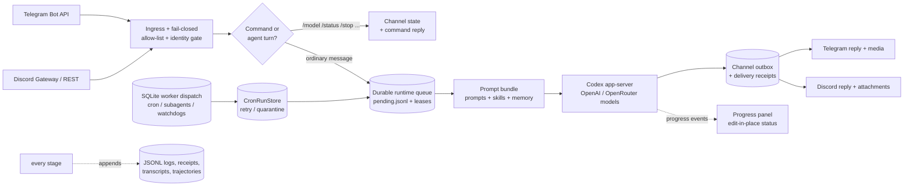

<div align="center">

# Agent Harness Core

**Self-hosted AI agent runtime in Rust. Run autonomous LLM agents over Telegram and Discord — with durable queues, fail-closed permissions, and an auditable receipt for every single step.**

[](#license)
[](rust-toolchain.toml)
[](Cargo.toml)
[](#faq)
[](CHANGELOG.md)

[Quick Start](#quick-start) •
[Features](#why-agent-harness-core) •
[Architecture](#how-it-works) •
[CLI](#cli-at-a-glance) •
[Docs](#documentation) •
[FAQ](#faq)

</div>

---

## What is Agent Harness Core?

Agent Harness Core is a **self-hosted AI agent harness written in Rust**: a runtime that connects chat channels (Telegram, Discord) to LLM coding agents (OpenAI Codex app-server, plus any model reachable through OpenRouter — Claude, GPT, Gemini, and more) through a durable job queue, bounded concurrency, and append-only JSONL receipts for every turn.

It is **not** another prompt-orchestration library. It is the **operations layer** for personal and small-team AI agents — the part that answers questions frameworks usually leave to you:

- What happens when the process dies mid-turn? *(durable queue + completed-turn recovery — the turn is not lost)*
- Who is allowed to talk to my agent? *(fail-closed allow-lists plus platform/account/channel identity bindings)*
- What exactly did the agent do at 03:12? *(append-only JSONL logs, receipts, transcripts, and trajectories for everything)*
- How do I stop a runaway turn? *(`/stop` cancel markers honored by the runtime poll loop)*

Born as a ground-up Rust rebuild of a Docker-based legacy agent gateway ("OpenClaw"), it keeps full import compatibility with that ecosystem — agents, sessions, skills, cron jobs, subagents, and memory snapshots migrate in with dry-run reports and receipts.

## Why Agent Harness Core?

| | What you get |
|---|---|
| 🧾 **A receipt for everything** | Every ingress, queue write, model turn, delivery, and retry appends to JSONL ledgers. Reconstruct any incident after the fact — no black boxes. |
| 📨 **Chat-native agents** | First-class Telegram Bot API and Discord (REST + Gateway) adapters: replies, media, attachments, message splitting, edit-in-place progress panels, default-off opt-in final-reply tone, and `/new` `/model` `/think` `/steer` `/stop` `/status` commands. |
| 🔐 **Fail-closed by default** | DMs require explicit admin allow-lists, and ingress must resolve a platform/account/channel identity binding before dispatch. Unknown senders or ambiguous channel bindings never reach the model. |
| ⚙️ **Durable, bounded work** | SQLite-backed worker dispatch with leases, retry/backoff, stale reaping, watchdogs, and concurrency limits per global / agent / channel / lane. Runtime dispatch classes isolate interactive, cron, worker, and maintenance turns so noisy cron work does not block channel agents. |
| 🤖 **Model-agnostic routing** | Codex app-server executes turns; OpenRouter routing switches any conversation to e.g. `anthropic/claude-sonnet-4` with one `/model` command. Provider-specific Codex homes keep OpenRouter config out of the default Codex/OAuth path; secrets are checked at preflight, never written to disk. |
| 🧠 **Memory-aware** | OpenClaw-compatible memory hooks (recall, lifecycle capture, store proposals) with vector recall over imported SQLite embeddings — integrated via adapters, not forks. |
| 📦 **Skills as runtime state** | Versioned, indexed `SKILL.md` runbooks are matched per turn and injected once per session via an injection ledger — no prompt bloat, no stale docs. Imported skill indexes cover both legacy and current OpenClaw namespace layouts. |
| 🪶 **Minimal dependencies** | Six crates: `serde`, `serde_json`, `ureq`, `rusqlite`, `ring`, `base64`. No tokio, no async runtime, no clap. Synchronous Rust you can read in an afternoon and audit forever. |
| 🔑 **Encrypted secret vault** | Repo-local vault using PBKDF2-HMAC-SHA256 + ChaCha20-Poly1305; `vault-get` reports presence and length, never plaintext. |
| 🔁 **Legacy migration built in** | Read-only dry-run import plans, conflict policies (skip/overwrite/rename), safe-copy execution that skips raw secrets by default, and cutover readiness gates. |

## How It Works



The harness owns ingress, permissions, queuing, prompt assembly, delivery, and audit. **Codex owns the model**: system prompt, tool schemas, MCP, sandbox, approvals, and session continuity. That split keeps the harness small, deterministic, and testable — 200+ tests run without any model call, using a bundled fake Codex app-server.

## Quick Start

```powershell
# Build and verify (no model account needed)
cargo test
cargo run -p agent-harness-cli -- doctor

# Import an existing OpenClaw-style deployment (read-only dry run first)
cargo run -p agent-harness-cli -- import-dry-run --source-home C:\path\to\.openclaw --target-home C:\path\to\.agent-harness --conflict skip --output imports\dry-run
cargo run -p agent-harness-cli -- import-execute --source-home C:\path\to\.openclaw --target-home C:\path\to\.agent-harness --conflict skip

# Check channel + runtime readiness, then go live
cargo run -p agent-harness-cli -- telegram-probe --target-home C:\path\to\.agent-harness
cargo run -p agent-harness-cli -- channel-identity-check --target-home C:\path\to\.agent-harness --platform telegram --account-id default --chat-id <chat-id> --agent main
cargo run -p agent-harness-cli -- cron-scheduler-lint --target-home C:\path\to\.agent-harness --dry-run --enable
cargo run -p agent-harness-cli -- cron-scheduler-run-once --target-home C:\path\to\.agent-harness --dry-run --enable
cargo run -p agent-harness-cli -- enable-check --target-home C:\path\to\.agent-harness
cargo run -p agent-harness-cli -- status --target-home C:\path\to\.agent-harness --json
```

Want to smoke-test the full pipeline offline? Pass `--codex-exe tools\agent-fake-codex-app-server\fake-codex-app-server.cmd` to `channel-run-once` and exercise prompt assembly, receipts, transcripts, and outbox delivery without a single model request.

The full ~70-command walkthrough — every importer, channel, queue, runtime, worker, cron, subagent, memory, and ops command with arguments — lives in the [Operations Handbook](docs/agent-harness-operations-handbook.md).

## CLI at a Glance

One binary, `agent-harness`, grouped into clear families:

| Family | Commands | What they do |
|---|---|---|
| **Import & registry** | `doctor`, `import-plan`, `import-dry-run`, `import-execute`, `registry`, `registry-export`, `channel-credentials-export` | Migrate a legacy agent deployment with dry-run reports, conflict policies, and redacted credential receipts. |
| **Channels** | `channel-identity-check`, `channel-receive`, `channel-run-once`, `channel-outbox-plan`, `telegram-probe`, `telegram-loop`, `discord-gateway-loop`, `discord-outbox-send-once`, … | Telegram/Discord ingress, identity binding, permission gating, slash commands, outbox delivery with retry ledgers. |
| **Runtime & queue** | `queue-enqueue`, `queue-prepare`, `runtime-run-once`, `runtime-loop`, `progress-delivery-loop` | Durable agent-turn queue, bounded-concurrency runtime loop, live progress panels, final-reply tone policy. |
| **Codex pipeline** | `codex-plan`, `codex-preflight`, `codex-launch-probe`, `codex-run`, `codex-complete`, `prompt-bundle` | Plan → preflight → launch → run → record, each stage inspectable and receipt-backed. |
| **Workers & scheduling** | `worker-enqueue`, `worker-loop`, `worker-status`, `cron-runs`, `cron-run-control`, `cron-plan`, `cron-scheduler-lint`, `cron-scheduler-run-once`, `cron-scheduler-loop`, `native-cron-enqueue`, `deterministic-cron-plan`, `subagent-plan`, … | SQLite-durable jobs: LLM subagents, native/deterministic cron scheduler ticks, no-LLM deterministic shell jobs, watchdogs, master wakeups, dedicated cron worker/runtime lanes, and cron skip/retry/quarantine controls. |
| **Memory** | `memory-hook`, `memory-search`, `memory-vector-search`, `memory-service-status/recall/propose/store`, `memory-read-path-smoke` | OpenClaw-compatible memory hooks, vector recall over imported snapshots, redacted credential/coverage reporting, and read-only memory smoke checks. |
| **Ops & security** | `status`, `enable-check`, `healthz`, `ops-backup`, `ops-cutover-request/approve/apply/status`, `ops-control`, `supervisor-plan`, `vault-put`/`vault-get`, `public-hygiene`, `invariants`, `schema-registry` | Health, observe-only supervisor service registry, live-control cutover tokens, backups, Windows Task Scheduler supervision plans, encrypted vault, release hygiene. |

## Design Principles

1. **Receipts over trust.** Two-phase persistence: intent is written before side effects, results are written after. If it isn't in a ledger, it didn't happen.
2. **Deterministic before generative.** Slash commands, permission checks, cron planning, and queue mechanics never call a model. Only ordinary agent turns do.
3. **Fail closed.** No allow-list match, no channel identity binding, no model access. Missing credentials fail at preflight, not mid-turn.
4. **Small surface, sync Rust.** No async runtime, no macro-heavy frameworks. Boring code that one person can fully audit.
5. **The model backend is a contractor, not a roommate.** The harness assembles payloads and records outcomes; Codex keeps its own session, tools, and sandbox. App-server protocol errors and failed turns are terminal runtime failures, not empty successful replies.

## Project Status

Pre-release, under active development, and **live-validated daily**: the reference deployment runs a single supervised runtime loop (concurrency 12) plus worker, progress, Telegram, Discord, and scheduler loops, with hundreds of delivered turns on record. Current staged work adds CronRunStore, dedicated cron worker/runtime lanes, one-shot and namespaced sticky cron sessions, and dispatch guards so cron LLM turns are observable, retryable, recoverable, and isolated from interactive channel turns.

See the [Changelog](CHANGELOG.md), the [Roadmap & Backlog](docs/agent-harness-core-roadmap-backlog.md), and the [Activation Readiness Plan](docs/activation-readiness-plan.md) for what's done, gated, and next.

## Documentation

| Document | What's inside |
|---|---|
| [Operations Handbook](docs/agent-harness-operations-handbook.md) | **Start here for operating the harness** — live topology, full command walkthrough, capability ledger. |
| [Development Handoff](docs/agent-harness-dev-handoff.md) | Architecture, runtime flow, module map, implementation priorities. |
| [Configuration](docs/configuration.md) | `harness-config.json` reference. |
| [Worker Dispatch Strategy](docs/agent-worker-dispatch-strategy.md) | Durable workers, cron lanes, subagents, watchdog design. |
| [Trust Boundaries](docs/trust-boundaries.md) | Where untrusted input enters and how it's bounded. |
| [Invariants](docs/invariants.md) & [Schema Registry](docs/schema-registry.md) | The contracts the test suite enforces. |
| [Test Handoff](docs/agent-harness-test-handoff.md) | Step-by-step live Telegram/Discord test plan. |
| [Function Self-Check Guide](docs/agent-harness-function-self-check-guide.md) | Agent checklist for proving new functions, CLI commands, receipt writers, and runtime paths before handoff. |
| [Release Checklist](docs/release-checklist.md) & [SECURITY.md](SECURITY.md) | Release gates and security policy. |
| [Doc Writing Guidelines](DOC-GUIDELINES.md) | How documentation in this repo is written and kept honest. |

## FAQ

**Which LLMs can I use?**
Any model Codex app-server can drive: OpenAI models natively, and the whole OpenRouter catalog (Anthropic Claude, Google Gemini, Meta Llama, …) via `/model openrouter/<provider-model-id>`. Switching models is a chat command, not a redeploy; OpenRouter routes use an isolated Codex home so they do not contaminate the default OpenAI/Codex route.

**Does it run on Linux or macOS?**
The core library and CLI are portable Rust, but the project is currently **Windows-first**: the supervisor planner targets Windows Task Scheduler and runtime lease locking uses exclusive Windows file handles. Cross-platform supervision is on the roadmap.

**Do I need Telegram or Discord?**
No. Every pipeline stage is a CLI command — you can enqueue, run, and inspect agent turns entirely from a terminal or your own scheduler.

**Is my data sent anywhere besides the model provider?**
No. The harness is fully self-hosted: state is local JSONL/SQLite under your harness home, secrets stay in env files or the encrypted vault, and the only network calls are to your chat platforms and your chosen model endpoint.

**How is this different from LangChain-style agent frameworks?**
Those help you *compose prompts and tools inside* an agent. Agent Harness Core sits *around* agents: ingress, permissions, durable queuing, concurrency, delivery, audit, and recovery. Use both if you like — the harness doesn't care how the model thinks, only that every step is gated and recorded.

**Is it production-ready?**
It's pre-release. It runs a real daily-driver deployment with hundreds of completed turns, but interfaces may change and some release gates (e.g. long-horizon parity evidence, advisory audits) are still being collected. Read [SECURITY.md](SECURITY.md) before exposing it to anyone you don't trust.

## Security

Secrets never enter receipts or logs; exports redact by default and `--include-sensitive` must be explicit. Inbound platform text is wrapped as bounded, untrusted context — never trusted instructions. See [SECURITY.md](SECURITY.md) for the reporting process and current posture.

## License

Dual-licensed under either of:

- **MIT License** ([LICENSE-MIT](LICENSE-MIT) or https://opensource.org/licenses/MIT)
- **Apache License, Version 2.0** ([LICENSE-APACHE](LICENSE-APACHE) or https://www.apache.org/licenses/LICENSE-2.0)

at your option. Unless you explicitly state otherwise, any contribution intentionally submitted for inclusion in this work by you, as defined in the Apache-2.0 license, shall be dual-licensed as above, without any additional terms or conditions.
