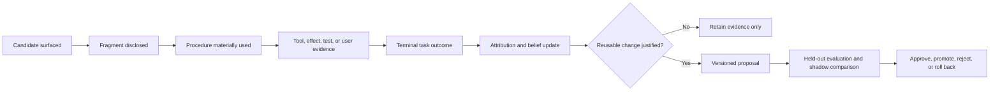

# Adaptive Skill Intelligence

> **Status: product design direction.** Agent Harness Core already provides auditable skill discovery and selection, revision-bound receipts, proposal-mediated mutation, guarded apply, lifecycle tooling, and virtual-session foundations. The outcome-linked learning, contextual belief, and progressive promotion system described here is not yet fully implemented or enabled.

[Read the web essay](https://phenomenoner.github.io/agent-harness-core/essay/adaptive-skill-intelligence/) or continue with the source-oriented design below.

## From Experience to Capability

People rarely solve every recurring problem from first principles. We combine outside experience—teaching, documentation, demonstrations, and other people's hard-won lessons—with our own attempts. We then reflect on what worked, what failed, and under which conditions. The result is a practical heuristic or procedure that can improve the next similar task.

Agent Harness Core treats a skill in the same spirit: a versioned piece of **procedural memory**. A skill is not simply more prompt text or a transcript excerpt. It is a reusable way to perform a competence role, with explicit activation boundaries, required inputs and tools, expected effects, evidence, cost, and revision identity.

This creates a capability asset that can compound across tasks. New evidence can improve an existing procedure, reveal a safer or cheaper variant, resolve a conflict, retire an obsolete approach, or justify a new skill. The model may remain unchanged while the agent around it becomes better adapted to its work and environment.

The objective is not unrestricted self-rewriting. It is **evidence-governed procedural learning**: observable, scoped, cost-aware, reversible, and measured against task outcomes.

## What Belongs in a Skill

An effective learning system begins by putting information in the right place.

| Information | Canonical home |
|---|---|
| Permissions, safety rules, and organizational policy | Runtime policy and configuration |
| Current objective, plan, progress, and blockers | Task and virtual-session state |
| A single task's events and result | Episode and evidence store |
| Stable facts, preferences, and entity knowledge | Semantic memory or reference store |
| Tool schemas and current provider capabilities | Capability registry |
| A reusable way to achieve an outcome | Skill |
| Large specifications, examples, scripts, and datasets | Cold references and assets loaded on demand |

This separation prevents one observation from silently becoming policy and prevents the same lesson from drifting across prompts, memory, plans, and skill bodies.

## The Design Objective

The ecosystem should maximize the expected improvement attributable to procedural memory after paying its full cost:

```text
net skill value
  = expected task-outcome improvement
  - context and retrieval cost
  - latency and tool cost
  - interference and conflict cost
  - safety and external-effect risk
  - evaluation and maintenance cost
```

Safety, authority, identity isolation, and reversibility are hard constraints, not values that a higher average score can offset. Selection count, skill views, patches, new files, and library growth are activity measures; none proves that the agent became more capable.

## Role-First Retrieval with Minimal Disclosure

The first question is not “which skill looks similar to this message?” It is “which competence role, if any, is unresolved in this task?” A task may need diagnosis, planning, domain execution, verification, safety review, or provider-specific delivery. It may need several complementary roles—or no skill at all.

The target retrieval path is:

1. Build a bounded task state from the current objective, stage, constraints, capabilities, authority, risk, and available evidence.
2. Apply hard agent, account, channel, user, tool, lifecycle, and permission eligibility before semantic ranking.
3. Identify unresolved competence roles.
4. Generate candidates outside model context and compare revision-specific utility, cost, uncertainty, freshness, and conflicts.
5. Disclose the smallest additional procedural fragment that is expected to improve the task.
6. Stop when required role coverage is adequate or the next fragment has no positive marginal value.

This is deliberately different from showing the model an ever-growing catalog or always choosing a fixed number of skills. Zero selected skills is a correct and important result.

### Residency and Competence Are Separate

How often a procedure is available is independent of what it knows how to do.

| Residency tier | Intended behavior |
|---|---|
| **Resident kernel** | A very small, broadly useful capsule is loaded by default only when its repeated benefit exceeds its permanent context and interference cost. |
| **Priority or predictive** | Metadata or content may be ranked or prefetched outside model context. Prefetch is not disclosure or use. |
| **Role on-demand** | The smallest useful procedure or reference slice is loaded after a task-local role is identified. |
| **Explicit or privileged** | Loading requires explicit invocation, authority, or approval; prediction cannot bypass that boundary. |

Resident admission, predictive prefetch, and on-demand disclosure are evaluated separately. A frequently used skill does not automatically deserve permanent residency.

## Stable Skills Across a Virtual Session

Agent Harness Core's virtual-session model provides the continuity boundary for long tasks. A task receives a manifest containing the exact skill revisions and topology it used. Concrete backend sessions may compact, resume, or roll over, but the task does not silently switch procedures because the library changed in the background.

The manifest can receive an explicit, receipted delta when the task changes materially—for example, a new competence role becomes necessary, a required tool appears, or a revision is quarantined for safety. Starting a new task creates a clean boundary. Background reflection may prepare future improvements, but it cannot rewrite the active task's procedural history.

## Learning from Experience

The learning loop keeps distinct events distinct:



Being selected or read is not success evidence. A multi-skill task does not give every selected skill equal credit. A user correction may indicate a retrieval mistake, a defective procedure, a composition conflict, an obsolete tool contract, or a one-off fact that should never become a skill.

The system supports two complementary reflection cadences:

- **Per task or round:** capture low-cost deterministic evidence and make bounded, idempotent belief updates.
- **Periodic reflection:** review several episodes for repeated patterns, drift, role or residency reclassification, conflicts, consolidation, or a persistent missing capability.

The rules that govern learning are themselves changed through a separate meta-policy review. A skill author, evaluator, and promoter should not all self-attest the same behavioral deployment.

## Contextual Beliefs, Not Popularity

There is no globally best skill. Utility depends on the revision, competence role, task context, available tools, backend, co-used procedures, risk, time, and environment.

The design therefore maintains separate, uncertainty-aware beliefs about:

- applicability to a role and context;
- execution reliability when appropriately applied;
- contribution to the final outcome;
- disclosure, latency, tool, and maintenance cost;
- evidence freshness and environment drift.

Hierarchical Bayesian updating is a useful mechanism because sparse contexts can borrow cautious priors from related roles while retaining uncertainty. It must not collapse into a popularity score. Weak or shared evidence produces a weak update; strong independently verified evidence may support several belief updates, several skill revisions, or a new skill when that is the smallest sufficient change set.

## Cost-Aware Evaluation

High-frequency reflection is only useful if evaluation costs less than the regret it prevents. Agent Harness Core uses a value-of-information principle: choose the least expensive evaluator that is sufficiently reliable for the evidence and risk class, then escalate when uncertainty or impact justifies it.

An evaluator cascade may use:

1. deterministic checks for schemas, effects, tests, identity, and known invariants;
2. statistical checks for repeated outcomes, calibration, drift, and cost;
3. a bounded lower-cost model for classification or comparison;
4. a stronger specialist model for ambiguous, novel, or high-impact proposals;
5. explicit operator review for privileged effects, policy-like changes, broad topology changes, or insufficient evidence.

Evaluator cost, escalation rate, later overturns, missed regressions, and decision-regret reduction are all measured. The model that performed a task is not automatically its own judge.

## Evolving the Library

Evidence can justify more than editing one body. The change set may update retrieval, revise several independently implicated skills, add a specialized variant, introduce a new skill, change residency, or alter relationships among skills. There is no semantic hard limit on the number of changes; every changed surface needs its own evidence chain, and coupled changes need atomic testing and rollback.

Consolidation is relationship-first rather than similarity-first:

- **equivalent** procedures may be merge candidates;
- one skill may **subsume** another while a cheaper specialist remains valuable;
- complementary roles should compose, not merge;
- dependencies preserve order;
- variants preserve tool, context, or risk distinctions;
- conflicts must be resolved before incompatible full procedures reach the model;
- supersession requires redirects, migration, and downgrade support.

A smaller catalog is not automatically better. The goal is lower total complexity and disclosure cost without losing low-frequency but important capability.

## Everyday Examples

The same loop applies beyond software development:

- **Life:** an agent can combine public travel guidance with observed packing mistakes, accessibility needs, timing, and verification outcomes to refine a reusable trip-preparation procedure. Addresses and current bookings remain task data, not skill content.
- **Interpersonal work:** an agent helping prepare difficult feedback can combine communication frameworks with the user's accepted revisions and later corrections. It should learn a scoped preparation procedure, not infer private psychological facts or turn one interaction into a universal rule.
- **Professional work:** an incident-response skill can incorporate vendor documentation, prior failure modes, recovery evidence, and post-incident review. A tool-version change may lower confidence in old evidence and trigger revalidation instead of blindly replaying an obsolete runbook.

In each case, external knowledge and individual experience are combined, but only reusable procedural structure is promoted into the skill asset.

## How Progress Is Measured

Comparisons are frozen before results are observed and report uncertainty by task, agent, channel, backend, and revision. The scorecard includes:

- outcome and verifier uplift against no-skill, current-policy, or prior-revision baselines;
- required-role coverage and calibrated no-skill abstention;
- irrelevant disclosure, repeated loads, and outcome lift per 1,000 skill tokens;
- latency, tools, retries, evaluator spend, and maintenance churn;
- wrong-procedure, conflict, correction, and invalid-composition rates;
- belief calibration, evidence freshness, attribution uncertainty, and drift;
- held-out regression, false promotion, rollback success, and lost coverage;
- zero tolerance for cross-identity exposure, unauthorized effects, policy bypass, secret leakage, or irreversible mutation.

This makes the design falsifiable. If a new router selects fewer skills but does not improve total outcome and cost, it is not better. If an updated skill looks clearer but loses a rare critical capability in replay, it is not an improvement.

## Harness and Backend Responsibilities

The backend already owns in-turn reasoning, tools, and native session behavior. The harness should not build a second competing semantic brain. It adds value where durable operational ownership matters:

| Backend | Agent Harness Core |
|---|---|
| In-turn reasoning and tool sequencing | Exact identity, authority, and eligibility |
| Native skill interpretation where supported | Virtual-session manifest and revision continuity |
| Semantic drafting and advisory proposals | Joined receipts, effects, outcomes, and attribution |
| Task-local adaptation | Proposal jurisdiction, independent evaluation, promotion, and rollback |

Each semantic decision has one owner. Capability negotiation prevents double selection, double disclosure, double learning, or conflicting continuation authority.

## Delivery Path

The project will move from foundations to adaptive behavior through observable gates:

1. correct unsafe or unattributed current learning behavior while preserving serving behavior;
2. run role-first routing, manifest, and evaluator policies in side-effect-free observation;
3. compare outcome, coverage, abstention, disclosure, latency, and cost on a frozen replay corpus;
4. join real task outcomes before generating governed content or topology proposals;
5. promote only reversible, independently evaluated changes in a narrow cohort;
6. widen autonomy by evidence and risk class, with a tested downgrade at every boundary.

Current implementation details and public compatibility behavior are documented in [Skill Ecosystem](skill-ecosystem.md). This article describes the product direction and evaluation contract, not a claim that broad autonomous evolution is already active.
